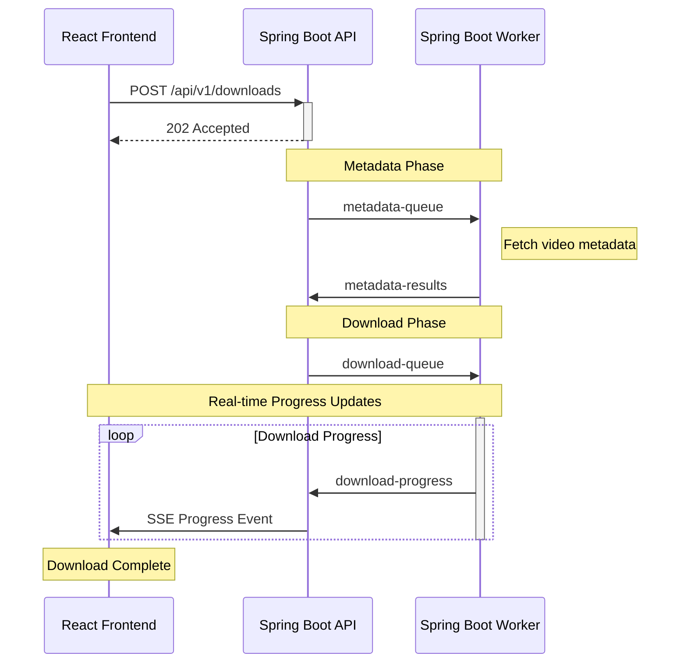

# Tailkeep - YouTube Video Archiver

[Demo Website](https://demo.tailkeep.org/)

## Description

Tailkeep is a free and open-source web application designed to help users download and archive YouTube videos. The primary motivation behind this project is to give users control over their data, especially in the context of the increasing tendency of big tech companies like YouTube to remove videos due to copyright strikes or other reasons. This is particularly relevant for music videos, song remixes, movie soundtracks and other content that might be taken down.

## Motivation

- **Control Over Data:** Users can have their own copies of videos, ensuring they are not lost due to removal from YouTube.
- **Preservation of Content:** Helps in archiving videos that might be removed due to copyright issues or creator's decisions.

## Features

- Download and archive YouTube videos.
- View and manage downloaded videos through a user-friendly dashboard.
- Store video metadata for easy retrieval and management.

## Architecture

The application is structured into four main components:

1. **API:** Handles the business logic and JWT authentication.
2. **Worker:** Manages the downloading and processing of videos in the background.
3. **Web:** React web UI.
4. **Media:** Go server used for serving static video and image files.

### Technologies Used

- **Java**
- **Spring Boot**
- **Lombok**
- **TypeScript**
- **React**
- **Next.js**
- **Tailwind CSS**
- **Server-Sent Events (SSE)**
- **PostgreSQL**
- **Apache Kafka**
- **PNPM**
- **Docker**
- **Traefik**

### Message Queues

The system uses Apache Kafka message queues for handling background tasks. This ensures that video downloading and processing tasks do not interfere with the main application's performance.

The following Kafka topics are used in the system:

| Topic               | Description                                                |
| ------------------- | ---------------------------------------------------------- |
| `metadata-queue`    | Used by API to request video metadata from Worker          |
| `metadata-results`  | Used by Worker to send back the fetched video metadata     |
| `download-queue`    | Used by API to request video downloads from Worker         |
| `download-progress` | Used by Worker to send real-time download progress updates |

Below is the sequence diagram showing the complete flow of a video download request:

### Database Schema

Below is the Entity Relationship Diagram showing the database structure:

